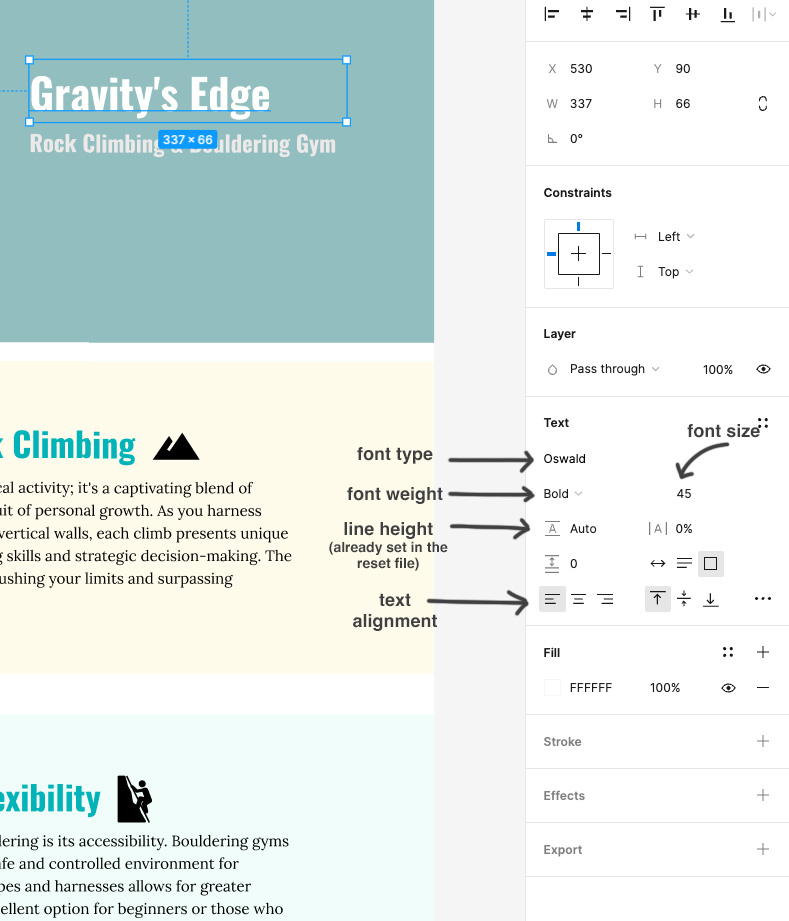

# Styling Text Exercise

## Instructions

- Complete the demo (demo-web-images) that was started in class. You should have the layout and web images complete, now finish styling the text using the Figma file to get the text information.

- Select the layer of text you want to examine and use the properties panel on the right to find the information.

- Bring the necessary fonts in from Google fonts, making sure to create one link request for both fonts. Place the links to the font library in the head of the document (after the title tag, but before the CSS files) and add the CSS rule to the appropriate elements making sure that the body has a default font style added to it.