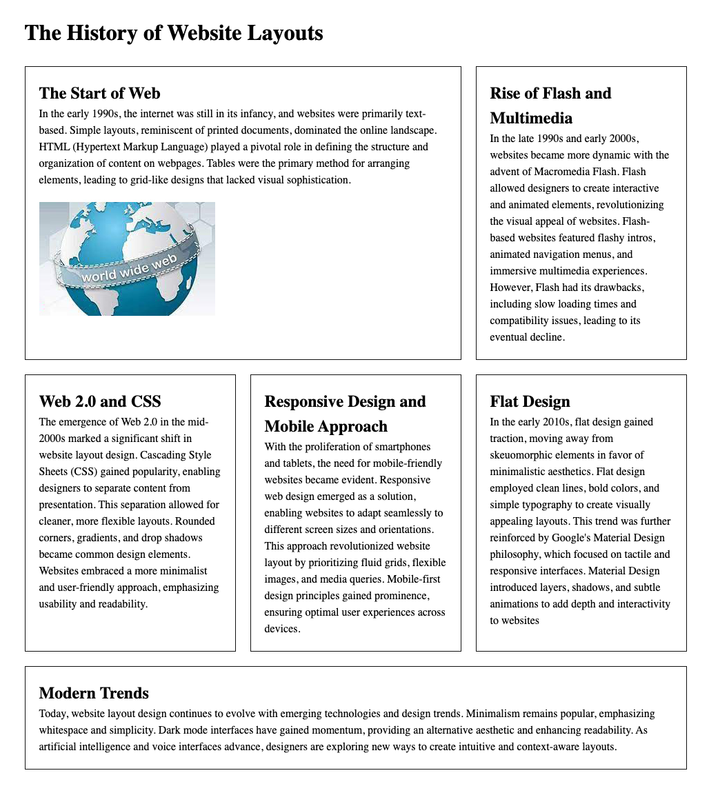

# The History of Website Layouts

## Introduction

Start by downloading the file called lab-4-assets.zip and extract the contents inside. Link the two provided external stylesheets and write the CSS rules to get the following layout. Using Flexbox and your knowledge of the box model, follow the build instructions provided in class.

